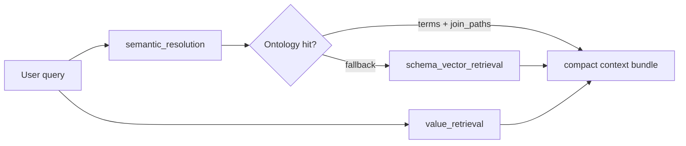

# Schema RAG, Value RAG, and LinkAlign — Modeling Notes

This note unpacks **§3 Advanced Retrieval and Schema Pruning (RAG)** and **§4 Database Content and Cell Value Retrieval** from the Step 1 design docs, explains **coarse-to-fine retrieval** and **LinkAlign**, and sketches how to model **`schema_vector_index`**, **`value_vector_index`**, **`ValueRetrieval`**, and companion scripts against the current repo (`scripts/`, `data/artifacts/`, `agent/`).

---

## What the docs mean (sections 3 & 4 + coarse-to-fine + LinkAlign)

### §3 Advanced retrieval and schema pruning (RAG)

**Goal:** Never dump the full catalog into the model. **Retrieve only a small, join-correct sub-schema** for each question—enough to write SQL, not enough to drown or cross-wire tables.

### §4 Database content and cell value retrieval

**Goal:** Fix **literal mismatch** (right column, wrong string in `WHERE`). Treat **categorical / formatted literals** as their own retrieval problem: index what the DB actually stores, then surface the canonical spellings before SQL generation.

### Coarse-to-fine vector retrieval

Two stages; both matter at scale:

- **Coarse (cheap, structural):** Narrow the candidate set with **metadata filters** that do *not* need embeddings—for example `source_id`, `schema`, domain tags, fact-vs-dimension hints, row-count tiers, or “only tables that touch orders.” This mirrors the Step 1 doc example (e.g. restricting to a “logistics” domain).
- **Fine (semantic):** Within that set, embed **short text chunks** (table summaries + column blurbs + join hints) and run **top‑k similarity** against the user question to pick the right tables and columns.

### LinkAlign methodology

*(See `system_design_docs/Markdown/Building a Text-to-SQL LangGraph Agent.md`.)*

LinkAlign is **not** “one vector search and done.” It is **iterative schema linking**: several **rounds** of retrieval plus **pruning irrelevant** tables/columns, optionally with **multiple passes or agents debating** what is in play, until you have a **dense sub-schema**.

In this codebase today, part of that spirit is already covered by:

- Ontology-first resolution (`semantic_terms` + `scripts/resolve_semantic_context.py` + disambiguation rules),
- Plus foreign-key subgraph material attached to resolver output.

A fuller LinkAlign-style node would **repeat** retrieve → score → drop noise → optionally re-query with a tightened query string until the payload is small and stable.

---

## What each build target means in product terms

| Concept | Meaning | Consumes | Produces |
|--------|---------|----------|----------|
| **`schema_vector_index`** | Search index over **schema text** (tables + columns as chunks), with **filter metadata** per vector (for coarse stage). | `metadata_catalog.<schema>.json` (ideally pinned via catalog version / structural hash) | Serialized vectors + ids + chunk metadata (e.g. FAISS index file + sidecar JSON mapping id → table/column / FK context) |
| **`value_vector_index`** | Search index over **cell literals** (and alias text), so user phrases like “Texas” can align with stored values such as `TX`. | Same catalog + optional DB `DISTINCT` pulls for **high-impact** categoricals + a **normalization / alias map** | Value vectors + provenance (table, column, raw value, optional frequency) |
| **`ValueRetrieval` module** | Runtime: given an NL query, **propose entities → search value index (and/or exact DB lookup) → return canonical literals + provenance + confidence.** | User query + `value_vector_index` + connector config | Structured hits: e.g. `{column_id, canonical_sql_literal, table, column, confidence, source: index|db}` |

**Confidence** is usually a blend of: embedding similarity, lexical match, alias-table hits, and consistency with **schema retrieval** for that question (same tables/columns in play).

---

## How to model it given current implementation

Three layers already align with the docs:

1. **Rich metadata** — `scripts/export_metadata_catalog.py` → `data/artifacts/metadata_catalog.<schema>.json` (PK/FK, comments, samples, row counts). **Source of truth for chunk text and filters.**
2. **Deterministic semantics** — `scripts/generate_semantic_terms.py`, `scripts/resolve_semantic_context.py`, `agent/nodes/semantic_resolution.py`. **Stronger than vector RAG where coverage exists**; vectors should **fill gaps** when ontology fallback applies (`fallback_used`).
3. **Connectivity / policy** — `data/artifacts/connector_registry.json` + `NEON_TEXT2SQL_URL`. Value indexing and DB verification respect **allowed schemas** and read-only intent.

### Recommended orchestration (conceptual)

- **Chunking for `schema_vector_index`:** e.g. one chunk per **table** (name, comment, PK, FK one-liners, column list with types + descriptions + sample snippet) and optionally **one chunk per column** on large schemas (Northwind is small; enterprise is not).
- **Metadata filters (coarse):** At minimum `schema=<name>`, `source_id` from connector registry; later add `domain`, `grain`, `fact_table` from heuristics or ontology.
- **`value_vector_index` “high-impact” columns:** Rule-based from catalog—text/varchar with bounded cardinality, or names like `country`, `region`, `category_name`, `company_name`, plus explicit allowlists tied to `semantic_terms` dimensions.
- **Normalization aliases:** Small map (JSON or embedded in chunk metadata), e.g. `Texas → TX`, merged into **embedding text** so synonymous forms stay near each other in vector space.

### Northwind-specific note

Northwind is tiny—**coarse filtering is barely visible**, but the pipeline should still be built so it **scales**. LinkAlign-style **multi-round** pruning can be simulated as: round 1 top‑k tables → expand neighbors via FK from catalog → round 2 re-rank columns only within those tables.

---

## Proposed scripts — responsibilities

### `scripts/build_schema_index.py`

- Load `data/artifacts/metadata_catalog.<schema>.json`.
- Build chunks (table-level and/or column-level).
- Embed (provider per project standard); write e.g. `data/artifacts/schema_vector_index.<schema>.faiss` + `schema_vector_index.<schema>.meta.json` (chunk id → table/column; pin **`structural_content_sha256`** for invalidation).
- Optional manifest: embedding model id + catalog binding (mirror `catalog_binding` pattern in `semantic_terms`).

### `scripts/build_value_index.py`

- Input: catalog + optional live `DISTINCT` sampling via `NEON_TEXT2SQL_URL` (respect connector governance).
- For each candidate column: index capped distinct values + optional alias expansion.
- Output: `value_vector_index.<schema>.faiss` + `.meta.json`, optional `value_index_stats.json` (coverage per column).

### `scripts/tag_sensitive_columns.py`

- Rule-based (+ optional assisted labeling); output `sensitive_data_tags.<schema>.json` (column → sensitivity label + rationale).
- Start from name heuristics (`email`, `phone`, `ssn`, …) and types; refine per org policy.

---

## Integration with `agent/`

- Extend **`TextToSQLState`** when wiring Step 2: e.g. `retrieved_schema_chunks`, `retrieved_values`, index versions tied to catalog hash.
- **`ValueRetrieval`:** e.g. `agent/nodes/value_retrieval.py` or `agent/tools/retrieve_cell_values.py`:
  1. Extract candidate phrases from the query (regex / light NLP).
  2. Query `value_vector_index`.
  3. Return ranked literals with provenance + confidence.

- Keep **`semantic_resolution` first**; on `fallback_used`, route to schema RAG using `schema_vector_index`; run or merge **value retrieval** when literals matter (geography, product/customer names, categories).

---

## References within this repo

- Step 1 narrative: `system_design_docs/step1/Data and RAG Preparation Pipeline.md`
- Step 1 execution checklist / artifacts: `system_design_docs/step1/Data and RAG Preparation Pipeline - Execution Template.md`
- LinkAlign discussion: `system_design_docs/Markdown/Building a Text-to-SQL LangGraph Agent.md`
